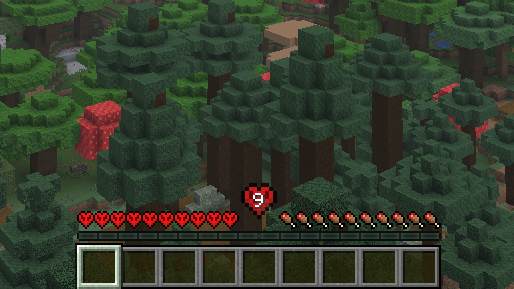

# Nine lifes

Nine lifes - is a mod which gives you only 9 lifes for entire your survival. Cool challenge for those who are tired of the vanilla hardcore. For changes in lives count - use `/nl` command. Enjoy!)

Don't use resource packs which changes hearts because this mod changes them to hardcore ones.

### Supported Minecraft versions
| Minecraft version | Max Nine lifes version |
|-------------------|------------------------|
| 1.21.11           | ✅ 2.0 (1.21.11)        |
| 1.21.10           | ✅ 2.0 (1.21.9)         |
| 1.21.9            | ✅ 2.0 (1.21.9)         |
| 1.21.8            | ❌ 1.9.1 (1.21.6)       |
| 1.21.7            | ❌ 1.9.1 (1.21.6)       |
| 1.21.6            | ❌ 1.9.1 (1.21.6)       |
| 1.21.5            | ❌ 1.5.3 (1.21.5)       |
